# Windows环境下jekyll配置

## ruby环境安装

安装链接：[点击这里安装对应版本的ruby+Devkit](https://rubyinstaller.org/downloads/)

安装完毕用ruby -v检验安装

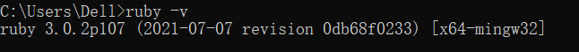

## 用Bundler安装Jekyll

### 基本步骤：

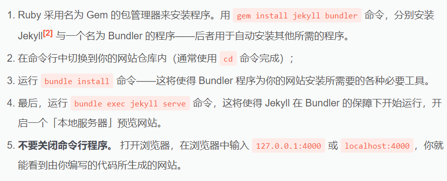

### 关于你的网站仓库

需要首先使用gitbash连接到你在github新建的仓库中，而连接可以通过两种方式：直接复制网址url；用SSH Key.

#### 配置SSH Key：

1. 用~/.ssh检查电脑是否有.ssh文件夹：

   如果没有则需要重新创建，具体可以参考reference文章

2. 添加SSH Key到github

3. 进入步骤一得到的路径，用复制文件中的内容到github的setting中的SSH Key设置中，可以得到它发送设置成功的邮件。

4. 在gitbash中输入ssh -T git@github.com, 如果得到如下表述，则设置成功。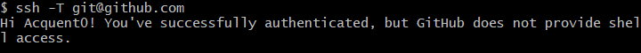

#### 与仓库简历SSH连接

1. 在对应路径输入git remote add + name + addr

   其中name表示push时本地仓库使用的名称；addr表示建立好仓库后提示的地址，注意仓库建立不要勾选readme。

   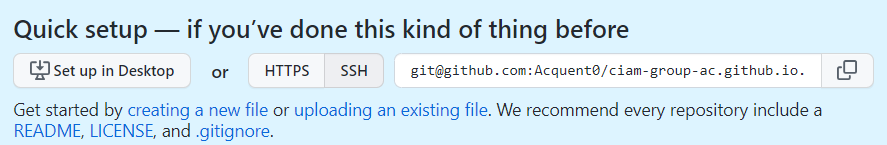

2. 用 git remote -v 检查是否连接成功

   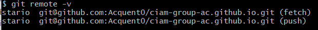

3. 如果以后不想再连接这个仓库，只需输入 git remote remove + name

#### 在github仓库中启用GitHub-page

在对应仓库的Setting中的Options中找到GitHub Pages点击启用

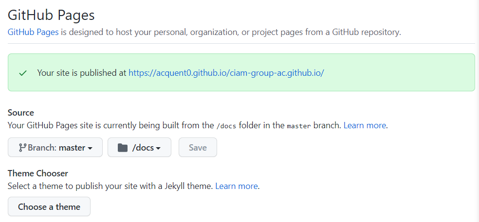

安装了jekyll-remote-theme插件就可以使用自己的主题了。

最后在本地git push到远程仓库中便可以同步更新到自己的GitHub pages上，以网页的形式展现md文档。

## jekyll的使用

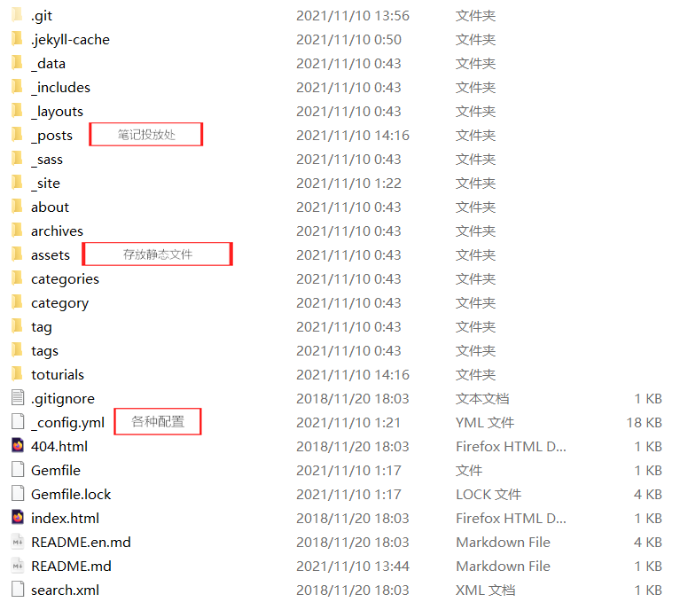

其中笔记需要以yyyy-mm-dd-name.md格式来写，且需要写类似如下头标题：

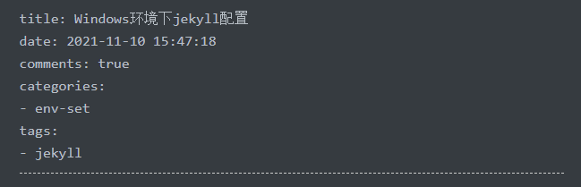

### 一些注意点

1. 使用bundle install命令需要目录中存在gemfile文件用于提供配置。

2. 进行步骤5时，可能遇到如下报错

   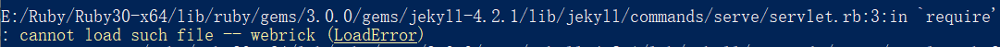

   这是因为Ruby3.0以上不会再自带WebRick，需要手动添加到环境里，执行 bundle add webrick即可，另再执行gem install github-pages, 安装完毕后会出现这个界面：

   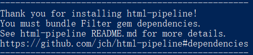

   看到这个我突然感觉可能要成了！困扰了我一个晚上的各种bug貌似要被解决了！新的希望！

   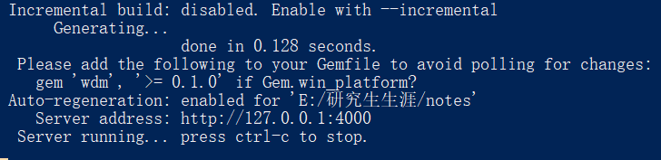

   成了！

   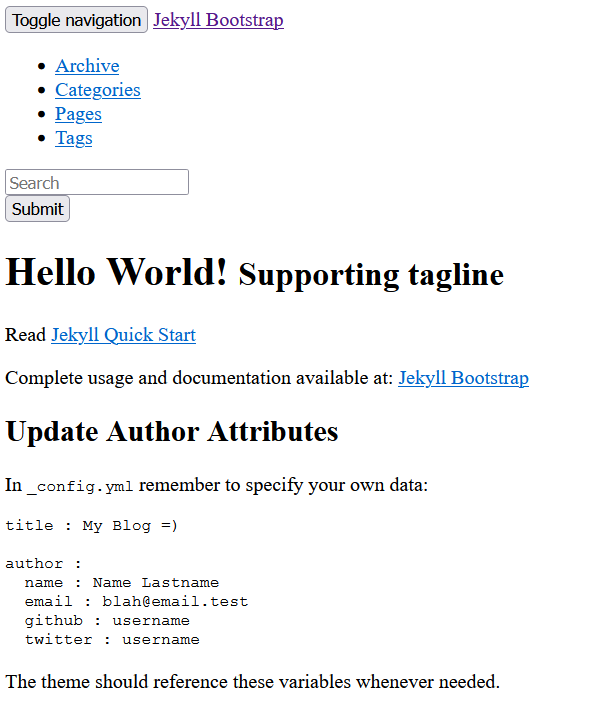

   现在就可以开始配置各种样式了！Duang！Nice！

3. 现在可以选择需要的样式了，[轻戳这里到官网选择](jekyllthemes.org)，最后根据你选择的样式，到其官网查超越需要安装的gem插件和各种配置来完善

4. md文档推送到github时，文件路径需要用斜杠而不是反斜杠。

## Reference：

[1.在 Windows 系统上安装 Jekyll]: https://xjtu-blacksmith.cn/notes/install-jekyll-on-windows
[2.GitHub教程 SSH keys配置]: https://blog.csdn.net/qq_36667170/article/details/79094257
[3.GitHub教程 Git Bash详细教程]: https://blog.csdn.net/qq_36667170/article/details/79085301
[4.GitHub Pages 与 Gitee Pages 上的 Jekyll]: https://xjtu-blacksmith.cn/essay/jekyll-of-pages
[5.Jekyll 安装、使用方法与卸载]: https://blog.csdn.net/u012675539/article/details/43734055
[6.Jekyll&amp;Github Pages博客模板挑选和配置]: http://cenalulu.github.io/jekyll/choose-a-template-for-your-blog/

